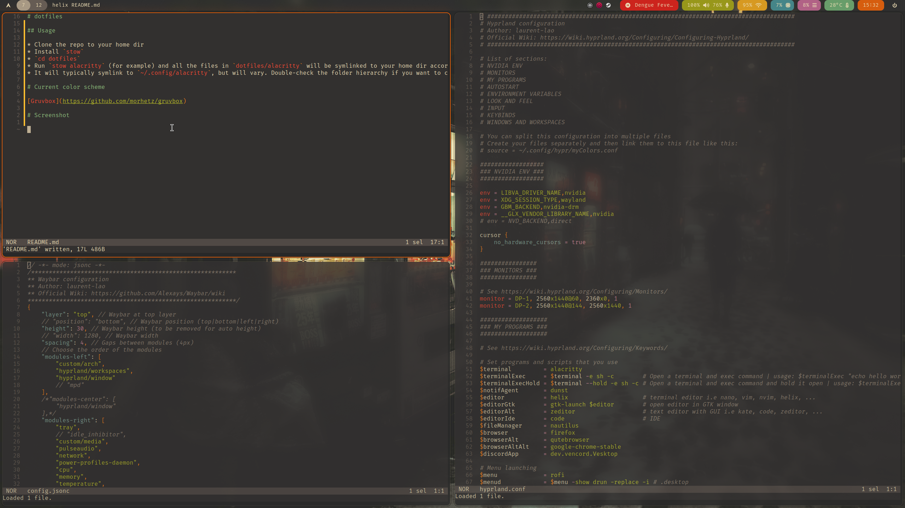

# dotfiles

Gotta have those under versioning control.

## Usage

* Clone the repo to your home dir.
* Install `stow`.
* `cd dotfiles`.
* Run `stow alacritty` (for example) and all the files in `dotfiles/alacritty` will be symlinked to your home dir according to the hierarchy inside `dotfiles/alacritty`.
* It will typically symlink to `~/.config/alacritty`, but will vary. Double-check the folder hierarchy if you want to customize the location.

## Current color scheme

[Gruvbox](https://github.com/morhetz/gruvbox)

## Screenshot

